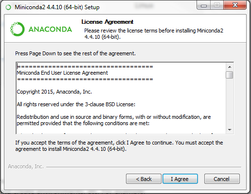
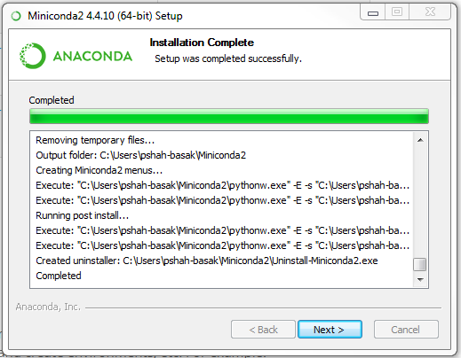

# Installation

You will need a Muse 2016 and Python installed on your computer. Psychopy, the stimulus presentation library that underlies most of the experiments, officially only supports Python 2. However, some users, especially those on Linux, have been able to work entirely in Python 3 without any issues.

`git clone https://github.com/neurotechx/eeg-notebooks`

Install all requirements.

`pip install requirements.txt`

See [here](http://eeg-notebooks.readthedocs.io/en/latest/setup_instructions_windows.html)
for more detailed setup instructions for windows operating systems.


# Windows setup instructions


## 1. Install miniconda

Miniconda is a 'mini' version of the anaconda python distribution.

Download the Windows miniconda installer from https://conda.io/miniconda.html (python 2.7 64-bit version)

Tip: you can check your windows operating system type in the Control Panel → System and Security → System


Run the installer and follow the steps below


Click Next


Click ‘I Agree’ 




Select ‘Just Me’ and click Next


Browse to the location where you want to install, or click Next to keep the default location (Tip: Make sure you have enough space available on your hard-drive for this installation) 


Once installation is complete, click Next



Click Finish


After the installation is complete, click on the Windows button and search for ‘Anaconda Prompt’ 
Tip: pin it to the Windows taskbar for easy access in the future

Click on Anaconda Prompt, which will bring up an anaconda terminal 

Create a conda environment for your neurobrite work:


`conda create -n “neurobrite”  python=2`

## 2. Download git for windows

Git is a version control system that will allow you to download and track changes to eeg notebooks. On Windows, it also gives you Git Bash, which is a useful linux-style terminal.

You can download git from: https://git-scm.com/download/win

Run the installation with default settings

## 3. Get eeg-notebooks

You have two options, pick one from the following:

1) With git bash:

`git clone --recursive https://github.com/NeuroTechX/eeg-notebooks`


de

2) Without git bash:

Navigate to the github repository (or https://github.com/NeuroTechX/eeg-notebooks) directly in a web browser and download eeg-notebooks.

Now, you are ready to use the jupyter notebook.

## 4. Install python dependencies

Go back to your open Anaconda Prompt (or open a new one) and navigate to the location where you installed eeg-notebooks. You can use the `cd` command to change directories (i.e. `cd eeg-notebooks`)

Activate the neurobrite conda environment. Note: you will need to activate this environment every time you start a new terminal when you want to do work within the neurobrite environment we are about to setup

`conda activate neurobrite`

Now, install the dependencies identified in the requirements.txt file. Note: this may take a long time, up to 15 minutes

`pip install -r requirements.txt`

## 5. (Optional ) Install BlueMuse

[BlueMuse](https://github.com/kowalej/BlueMuse) is a Windows 10 program that allows communication between a Muse headband and a computer's native bluetooth drivers using the LSL communication protocol. It can be used as an alternative to an external BLED112 dongle. 

To install, go the the [ `BlueMUSE` github website](https://github.com/kowalej/BlueMuse) and follow the installation instructions.

## 6. Start a jupyter notebook session

Finally, start a jupyter notebook session from your Anaconda Promt in the eeg-notebooks directory

`jupyter notebook`

A browser should automatically open. If it doesn't, visit `localhost:8888`.

This should bring up the `eeg-notebooks` folder structure. You will find the list of available experiments in the `notebooks` folder.

# Linux setup instructions

## Using Miniconda

### 1. Download and install Miniconda

Go to the downloads section of the miniconda website [HERE](https://docs.conda.io/en/latest/miniconda.html#linux-installers) 
and download the appropriate installed for your Linux system.

Verify the hashes by running the command (you might need to change the path to the file)
```terminal
$ sha256sum ~/Downloads/Miniconda3-latest-Linux-x86_64.sh
```

In the same terminal, run the command
```terminal
$ bash ~/Downloads/Miniconda3-latest-Linux-x86_64.sh
```

Follow the prompts and select the defaults.

### 2. Create environment

Close and reopen the terminal for conda to take effect. Create a new conda environment for EEG-notebooks with the command
```terminal
$ conda create -n "eeg-notebooks" python=3
```

### 3. Install git

Install git for linux
```terminal
$ sudo apt install git
```

### 4. Get EEG notebooks

Navigate to your desired directory in a terminal and clone the repo
```terminal 
$ git clone https://github.com/eeg-notebooks
```

### 5. Install python dependencies

Navigate to the installed repo and activate your conda environment using
```terminal
$ cd ~/path/to/eeg-notebooks
$ conda activate eeg-notebooks
```

Then install the python dependencies
```terminal
$ pip install -r requirements.txt
```

### 6. Test installation

Start a jupyter notebooks session and you will be presented with the eeg-notebooks file structure. You can test the 
installation by opening a new jupyter notebook and running a cell containing the following
```python
from eegnb.devices.eeg import EEG
from eegnb.experiments.visual_n170 import n170

# create eeg_device using the synthetic brainflow device
eeg_device = EEG(device='synthetic')

# run stimulus presentation for 20 seconds
n170.present(duration=20, eeg=eeg_device)
```

## Using a VirutalEnv

## Global installation