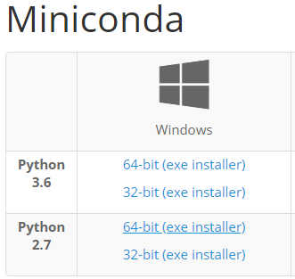
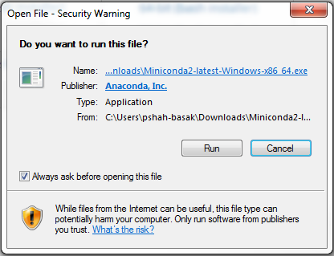
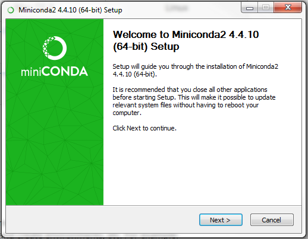
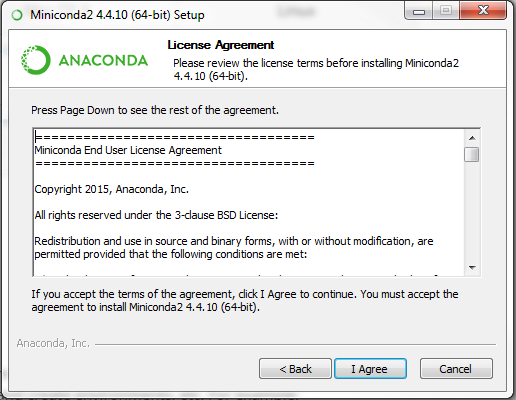
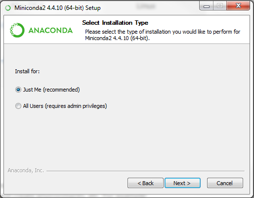
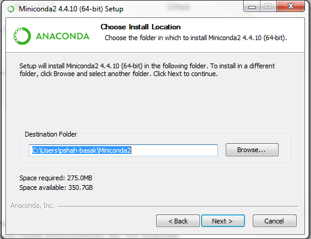
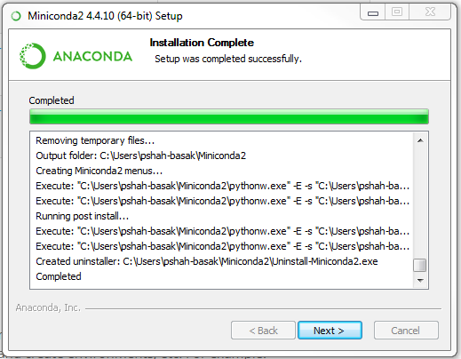
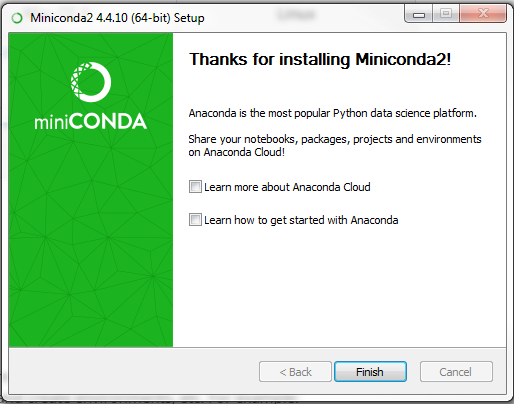
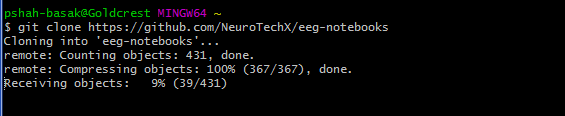

# muse-lsl + eeg-notebooks windows installation + setup instructions

## 1. Install miniconda

Miniconda is a 'mini' version of the anaconda python distribution.

Download the Windows miniconda installer from https://conda.io/miniconda.html (python 2.7 64-bit version)

Tip: you can check your windows operating system type in the Control Panel → System and Security → System

Run the installer and follow the steps below

Click Next

Click ‘I Agree’ 

Select ‘Just Me’ and click Next

Browse to the location where you want to install, or click Next to keep the default location (Tip: Make sure you have enough space available on your hard-drive for this installation) 

Once installation is complete, click Next

Click Finish

After the installation is complete, click on the Windows button and search for ‘Anaconda Prompt’ 
Tip: pin it to the Windows taskbar for easy access in the future

Click on Anaconda Prompt, which will bring up an anaconda terminal 

Create a conda environment for your neurobrite work:

`conda create -n “neurobrite”  python=2`

## 2. Download git for windows

Git is a version control system that will allow you to download and track changes to eeg notebooks. On Windows, it also gives you Git Bash, which is a useful linux-style terminal.

You can download git from: https://git-scm.com/download/win

Run the installation with default settings

## 3. Get eeg-notebooks

You have two options, pick one from the following:

1) With git bash:

`git clone --recursive https://github.com/NeuroTechX/eeg-notebooks`

de

2) Without git bash:

Navigate to the github repository (or https://github.com/NeuroTechX/eeg-notebooks) directly in a web browser and download eeg-notebooks.

Now, you are ready to use the jupyter notebook.

## 4. Install python dependencies

Go back to your open Anaconda Prompt (or open a new one) and navigate to the location where you installed eeg-notebooks. You can use the `cd` command to change directories (i.e. `cd eeg-notebooks`)

Activate the neurobrite conda environment. Note: you will need to activate this environment every time you start a new terminal when you want to do work within the neurobrite environment we are about to setup

`conda activate neurobrite`

Now, install the dependencies identified in the requirements.txt file. Note: this may take a long time, up to 15 minutes

`pip install -r requirements.txt`

## 5. (Optional ) Install BlueMuse

[BlueMuse](https://github.com/kowalej/BlueMuse) is a Windows 10 program that allows communication between a Muse headband and a computer's native bluetooth drivers using the LSL communication protocol. It can be used as an alternative to an external BLED112 dongle. 

To install, go the the [ `BlueMUSE` github website](https://github.com/kowalej/BlueMuse) and follow the installation instructions.

## 6. Start a jupyter notebook session

Finally, start a jupyter notebook session from your Anaconda Promt in the eeg-notebooks directory

`jupyter notebook`

A browser should automatically open. If it doesn't, visit `localhost:8888`.

This should bring up the `eeg-notebooks` folder structure. You will find the list of available experiments in the `notebooks` folder.
